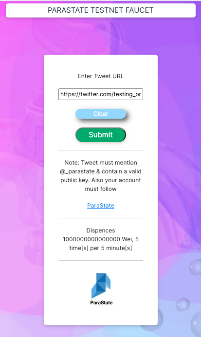

# Universal Faucet (for Ethereum compatible blockchain networks)

# What does it do?

This software provides Ethereum compatible blockchain tokens; think of this as a "Faucet as a Service".
It provides a web page interface (where users can paste in a social media post URL).
It also provides an RPC endpoint (which can be called manually or programatically).
This software has specific rate limiting built in.
Just as with settings like `token_amount_in_wei`, `blockchain_rpc`, `blockchain_chain_id` and so forth, the aforementioned rate limiting (`user_rate_limit` & `rate_limit_duration`) is completely configurable i.e. one token per hour or 10 tokens per day etc.

# What problem does it solve?

At present blockchain faucets are prone to being spammed; even in cases where the blockchain tokens are not worth much. This spamming overloads the faucet hosting and also dries up faucet supply. This makes it hard for legitimate smart contract developers etc. to obtain free tokens.

# How does it work?

This node application allows users to paste in a Tweet URL

This application transfers the blockchain token from the faucet to the user's account.

# What is configurable
As many parameters as possible will be configurable. This is good for security (separate config file) and also allows this code to be reused for other projects. 

## How to host it (as a faucet for your own blockchain network)

### System dependencies

**Ubuntu example**

```bash
sudo apt update
sudo apt install nodejs npm
```

### Fetch the code

```bash
git clone https://github.com/ParaState/universal-blockchain-faucet.git
```

Change directories

```bash
cd universal-blockchain-faucet
```

### Configure 

Create a new file called `.env` and add the following text (fill out your specific config options)

```python
# A throw away practice key (never store large amounts in this address for obvious reasons)
faucet_private_key=
faucet_public_key=0x445b1693022ca7Bc4251E4a134823eC0e2CF9850
blockchain_rpc=https://rpc.parastate.io:8545
blockchain_chain_id=123
# How many times a user can use this server per duration period
user_rate_limit=5
# The duration period in minutes i.e. 1440 is 24 hours
rate_limit_duration=5
# How many times a user's account i.e. Twitter or Telegram can get ERC20 tokens (and one network token by default)
a_users_account_rate_limit=1
# The duration period in minutes for ERC20 drip i.e. 1440 is 24 hours
a_users_account_rate_duration=525600
# How many times a user's account i.e. Twitter or Telegram can get a network token (because the prior config is for ERC20 tokens)
a_users_account_rate_limit_2=1
# The duration period in minutes for network token drip i.e. 1440 is 24 hours
a_users_account_rate_duration_2=1440
# The amount of wei to be sent per airdrop i.e. 1000000000000000000 (to send 1 ETH)
token_amount_in_wei=1000000000000000000
# ERC20 token amount - IMPORTANT, please check decimal places of deployed contract i.e. standard is 18 decimal places
erc20_token_amount_in_wei=1000000000000000000
blockchain_logo_url=https://pbs.twimg.com/profile_images/1357246244540751873/zhVBBG5-_400x400.jpg
blockchain_name=ParaState Testnet
blockchain_description=ParaState Testnet
blockchain_block_explorer_url=http://scan.parastate.io/
# URL and path to address/account, include trailing slash i.e. https://explore.io/address/
blockchain_block_explorer_address_url=http://scan.parastate.io/account/
# URL and path to transaction/tx etc, including trailing slash i.e. https://explore.io/tx/
blockchain_block_explorer_transaction_url=http://scan.parastate.io/tx/
# Override gas price
gas_price=5000000000
# Override gas limit
gas_limit=8000000
# Flavour of client's web3 i.e. oeth (Oasis Ethereum), cmt (CyberMiles), eth (Ethereum), state (ParaState), dot (Polkadot)
web3_flavour=eth
server_name=localhost
server_port=8001
# Are you using HTTPS (letsencrypt)? yes/no
https=yes
host=0.0.0.0
# data_dir=/home/azureuser/universal-faucet-data
data_dir=/Users/tpmccallum/universal-faucet-data
twitter_bearer_token=
twitter_api_key=
twitter_api_secret_key=
# Twitter Id of the blockchain you can use a site like tweeterid com to convert a handle to an id
twitter_id=1320374428979527681
twitter_handle=@_parastate
twitter_url=https://twitter.com/_parastate
telegram_bot_token=
telegram_bot_name=parastate_testnet_faucet_bot
username_faucet_bot=ParaStateTestnetFaucetBot
erc20_name=Slot Token
erc20_symbol=SLOT
erc20_address=0x282d93490e1f2129b94add74d68187206bf94585
erc20_tx=0x109ff8f54574ece2f7b082cd56f368b1c8343b452c855aa2110b9ea88982b9ba
```

### Data directory

Create a data directory which is the same as what you just set in the `.env` file

```bash
sudo mkdir -p /Users/tpmccallum/universal-faucet-data
sudo chown -R $USER:$USER /Users/tpmccallum/universal-faucet-data
```

### Create the data files

```bash
touch /Users/tpmccallum/universal-faucet-data/data.txt
touch /Users/tpmccallum/universal-faucet-data/success.txt
touch /Users/tpmccallum/universal-faucet-data/success2.txt
touch /Users/tpmccallum/universal-faucet-data/funded.txt
```
The `data.txt` file stores web usage (page loads/page refresh etc.) on a per social media account basis. Generally 5 requests per 5 minutes, then rate limit.
The `success.txt` file stores successfuly ERC20 transfers on a per social media account basis. For ParaState this is one ERC20 token per social media account, then rate limit.
The `success2.txt` file stores successfuly network token transfers on a per social media account basis. For ParaState this is one network token per social media account per day (1 network token every 24 hours), then rate limit. This allows users to come back and get network tokens each day.
The `funded.txt` file stores successfuly ERC20 transfers on a blockchain account address basis. For ParaState this is one ERC20 token per external account address, then rate limit.

### Install node dependencies automatically

```bash
npm install
```

### Start

```bash
npm run prod
```

## How to use it (as an end user)

### Web site

Users will visit the site and paste in their Twitter URL



### Rate limiting

The faucet uses rate limiting which will return the [429 Too Many Requests](https://developer.mozilla.org/en-US/docs/Web/HTTP/Status/429) response code; if rate is exceeded. For web users the following static page will be shown as the visual response (still technically a 429 response with a static page attached)


## Development

If you would like to contribute to this project and you don't want your `.env` file to be pushed to this repo, please run the following commands. 

```bash
git rm .env --cached
git commit -m "Stopped tracking .env File"
```

## Hosting Node using SSL

If you would like to host this as a stand alone faucet for your own project it is advised that you use letsencrypt and provide users with https address (as apposed to just hosting locally via http for testing and dev purposes).

First install these packages on Ubuntu operating system.

```bash
sudo apt-get update
sudo apt-get -y upgrade
sudo apt-get install -y certbot
```

Create a new directory for the letsencrypt certificates

```bash
sudo mkdir /etc/letsencrypt
sudo chown $USER:$USER -R /etc/letsencrypt
```

Part of the verification of letsencrypt requires that you host a text file at a specific location on the server. The quickest way to do this is to install apache2 and use /var/www/html path on the server.

First install apache2

```bash
sudo apt install apache2
```

Then log into your server with another session (so you can perform the validation whilst also writing to www/html dir) 

Once you have two sessions open, run the following command to create and verify the certificates. It is just a matter of following the prompts.

```bash
sudo certbot certonly --manual
```

Certbot will provide you with some text data and a URL, you must follow the prompts as roughly outlined below.

Create a file containing just the data provided to you (let's pretend the data was `asdfasdf`):

Then make that data available on your web server at the URL provided to you, let just pretend that this is the URL provided i.e. ending in `asdf`.

http://testnet.faucet.parastate.io/.well-known/acme-challenge/asdf

```
By now you have essentially written the data provided by the `certbot` command to the file path provided by the `certbot` command.

```bash
sudo mkdir -p .well-known/acme-challenge
vi asdf
```

For example, enter the text `asdfasdf` and save `asdf` file.

You will also need to open port 80 so that `certbot` can see the data in that file.

Then press enter to continue in the `certbot` terminal so that certbot can go ahead and get that acme-challenge (verification) finished.

When the verification is finished you will need to update the ownership of the new certificates in the letsencrypt location (because they were written by root not your user). Simply do the following (to prevent an error like this `Error: EACCES: permission denied, open '/etc/letsencrypt` when starting the faucet)

```bash
sudo chown $USER:$USER -R /etc/letsencrypt
```
## Ensuring uptime

Go ahead and create a file called `start_faucet.sh` in a specific location i.e. `/a_path_to/start_faucet.sh`. 

Paste in the following script but ensure that your `universal-blockchain-faucet` path is correct and also that your `/home/tpmccallum/.npm-global/bin/forever` path is correct. Hint type `which forever` to see where it is installed on your machine.

```bash
#!/bin/bash
cd /media/nvme/universal-blockchain-faucet
/home/tpmccallum/.npm-global/bin/forever start index.js
```

You can then go ahead and create a file called `check_faucet.sh` and fill it with the following. Again, please check your paths because they will be different to these.

```bash
#!/bin/bash
SS_FAUCET=$(ps -ax | grep -c "/media/nvme/universal-blockchain-faucet/index.js")
if [ $SS_FAUCET -gt 1 ] 
then
    echo $(date)
else
    echo "Starting, please wait ..."
    ( exec "/a_path_to/start_faucet.sh" )
    echo "Success!"  
fi
```

Now make both of these files executable.

```bash
sudo chmod a+x start_faucet.sh
sudo chmod a+x check_faucet.sh
```

The last step is to add the automatic execution of these scripts to cron

```bash
crontab -e
```

Then insert the following lines (making sure that your paths are correct, because the following example is probably not correct for your system)

```bash
* * * * * /a_path_to/check_faucet.sh  > /a_path_to/faucet_log.txt 2>&1
```

If the faucet is not running it will start it. If the faucet is running it will just record the date to the file. It does not append; it overwrites. Essentially the `/a_path_to/faucet_log.txt` will have a single line in it at all times (showing the date of the last uptime).

## Offering redirects

It is also advised that you provide a redirect message for users who just visit the site's base domain i.e. if a user goes to `testnet.faucet.parastate.io` instead of the actual endpoint of `https://testnet.faucet.parastate.io:8081/faucet` 

To do this, go ahead and configure apache2 as follows.

```bash
sudo apt-get update
sudo apt-get upgrade -y
```

Create the following area

```bash
sudo mkdir -p /var/www/html/testnet.faucet.parastate.io/public_html
```

Then create the following file

```bash
sudo vi /var/www/html/testnet.faucet.parastate.io/public_html/index.html
```

Adding the following content to that index.html file (obviously change details to suite your project)

```html
<!DOCTYPE html PUBLIC "-//W3C//DTD XHTML 1.0 Transitional//EN" "http://www.w3.org/TR/xhtml1/DTD/xhtml1-transitional.dtd">
<html xmlns="http://www.w3.org/1999/xhtml">
  <!--
    Modified from the Debian original for Ubuntu
    Last updated: 2016-11-16
    See: https://launchpad.net/bugs/1288690
  -->
  <head>
    <meta http-equiv="Content-Type" content="text/html; charset=UTF-8" />
    <title>Welcome</title>
  </head>
  <body>
          <p>ParaState Testnet Faucet: <a href="https://testnet.faucet.parastate.io:8001/faucet"> https://testnet.faucet.parastate.io:8001/faucet</a></p>
          <p>ParaState Website: <a href="https://www.parastate.io/"> https://www.parastate.io/</a></p>
          <p>ParaState GitHub: <a href="https://github.com/ParaState"> https://github.com/ParaState/</a></p>
  </body>
</html>

```
We then cop the default configuration

```bash
cp /etc/apache2/sites-available/000-default.conf /etc/apache2/sites-available/testnet.faucet.parastate.io.conf
```

We then open that file

```bash
sudo vi /etc/apache2/sites-available/testnet.faucet.parastate.io.conf
```

Adding the following content (again please change details to suite your project)

```
ServerAdmin webmaster@testnet.faucet.parastate.io
ServerName testnet.faucet.parastate.io
ServerAlias www.testnet.faucet.parastate.io
DocumentRoot /var/www/html/testnet.faucet.parastate.io/public_html
```
We then activate this new site

```bash
sudo a2ensite testnet.faucet.parastate.io
```

We then reload apache2

```bash
sudo systemctl reload apache2
```

```bash
sudo apt-get install software-properties-common -y 
sudo snap install --classic certbot
```

```bash
sudo apt-get install certbot python3-certbot-apache -y
```

```bash
sudo certbot --apache
```

Then follow the options of `1` and/or `2` as I have done (hint: I selected `2` then `2`)

```bash
sudo certbot --apache
Saving debug log to /var/log/letsencrypt/letsencrypt.log
Plugins selected: Authenticator apache, Installer apache

Which names would you like to activate HTTPS for?
- - - - - - - - - - - - - - - - - - - - - - - - - - - - - - - - - - - - - - - -
1: testnet.faucet.parastate.io
2: www.testnet.faucet.parastate.io
- - - - - - - - - - - - - - - - - - - - - - - - - - - - - - - - - - - - - - - -
Select the appropriate numbers separated by commas and/or spaces, or leave input
blank to select all options shown (Enter 'c' to cancel): 1
Cert not yet due for renewal

You have an existing certificate that has exactly the same domains or certificate name you requested and isn't close to expiry.
(ref: /etc/letsencrypt/renewal/testnet.faucet.parastate.io.conf)

What would you like to do?
- - - - - - - - - - - - - - - - - - - - - - - - - - - - - - - - - - - - - - - -
1: Attempt to reinstall this existing certificate
2: Renew & replace the cert (limit ~5 per 7 days)
- - - - - - - - - - - - - - - - - - - - - - - - - - - - - - - - - - - - - - - -
Select the appropriate number [1-2] then [enter] (press 'c' to cancel): 2
Renewing an existing certificate
Created an SSL vhost at /etc/apache2/sites-available/testnet.faucet.parastate.io-le-ssl.conf
Deploying Certificate to VirtualHost /etc/apache2/sites-available/testnet.faucet.parastate.io-le-ssl.conf
Enabling available site: /etc/apache2/sites-available/testnet.faucet.parastate.io-le-ssl.conf

Please choose whether or not to redirect HTTP traffic to HTTPS, removing HTTP access.
- - - - - - - - - - - - - - - - - - - - - - - - - - - - - - - - - - - - - - - -
1: No redirect - Make no further changes to the webserver configuration.
2: Redirect - Make all requests redirect to secure HTTPS access. Choose this for
new sites, or if you're confident your site works on HTTPS. You can undo this
change by editing your web server's configuration.
- - - - - - - - - - - - - - - - - - - - - - - - - - - - - - - - - - - - - - - -
Select the appropriate number [1-2] then [enter] (press 'c' to cancel): 2
Redirecting vhost in /etc/apache2/sites-enabled/testnet.faucet.parastate.io.conf to ssl vhost in /etc/apache2/sites-available/testnet.faucet.parastate.io-le-ssl.conf

- - - - - - - - - - - - - - - - - - - - - - - - - - - - - - - - - - - - - - - -
Your existing certificate has been successfully renewed, and the new certificate
has been installed.

The new certificate covers the following domains:
https://testnet.faucet.parastate.io

You should test your configuration at:
https://www.ssllabs.com/ssltest/analyze.html?d=testnet.faucet.parastate.io
- - - - - - - - - - - - - - - - - - - - - - - - - - - - - - - - - - - - - - - -

IMPORTANT NOTES:
 - Congratulations! Your certificate and chain have been saved at:
   /etc/letsencrypt/live/testnet.faucet.parastate.io/fullchain.pem
   Your key file has been saved at:
   /etc/letsencrypt/live/testnet.faucet.parastate.io/privkey.pem
   Your cert will expire on 2021-11-08. To obtain a new or tweaked
   version of this certificate in the future, simply run certbot again
   with the "certonly" option. To non-interactively renew *all* of
   your certificates, run "certbot renew"
 - If you like Certbot, please consider supporting our work by:

   Donating to ISRG / Let's Encrypt:   https://letsencrypt.org/donate
   Donating to EFF:                    https://eff.org/donate-le

```

**Please note:** Any time you install, reinstall, or update certificates you will need to run the following chown command; because these certificate files are written to the letsencrypt folder as non user

```bash
sudo chown -R $USER:$USER /etc/letsencrypt/
```

Now, any visitors to your site (regardless if they visit `http` or `https` on the base domain via port 80), will receive the contents of the `/var/www/html/testnet.faucet.parastate.io/public_html/index.html` file; we created eariler. This is awesome because you can give them a hyperlink to the actual faucet on port 8001 and in addition some details about your blockchain, community, social media and so forth.

# Telegram

To create new bot you must ask the BotFather the following command

`/newbot`

To allow all messages through you must ask the following command of the BotFather and then select `Disable`

`/setprivacy`
